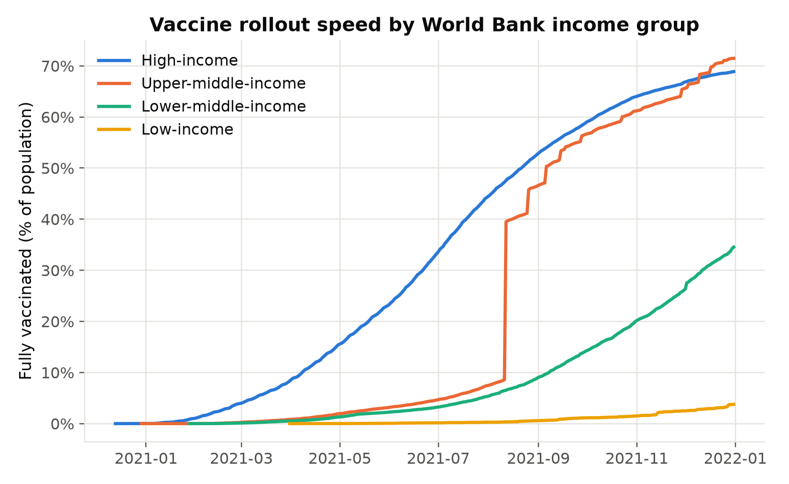
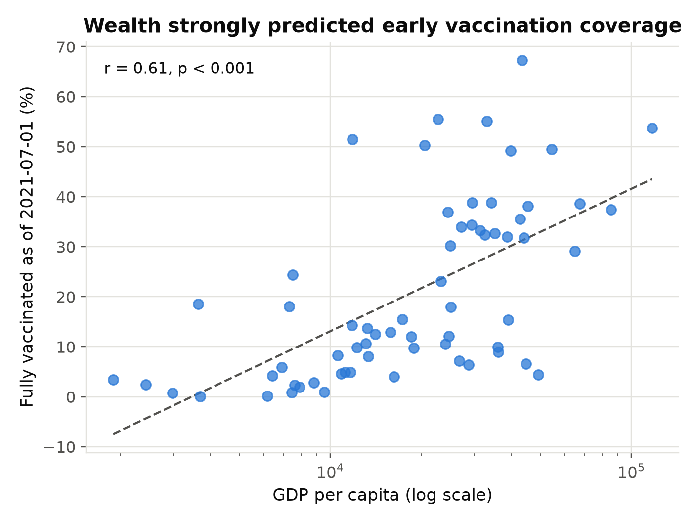
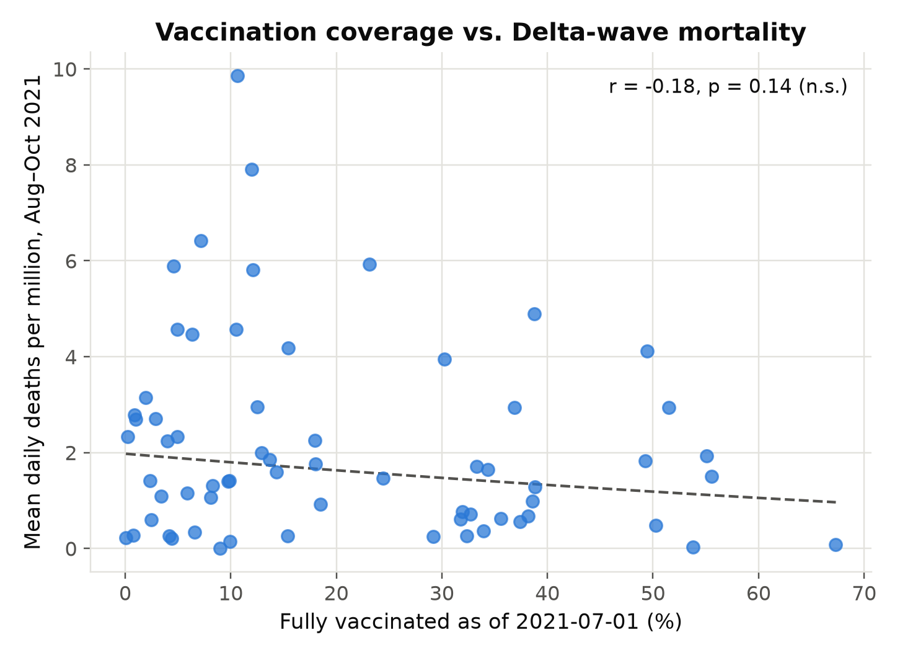
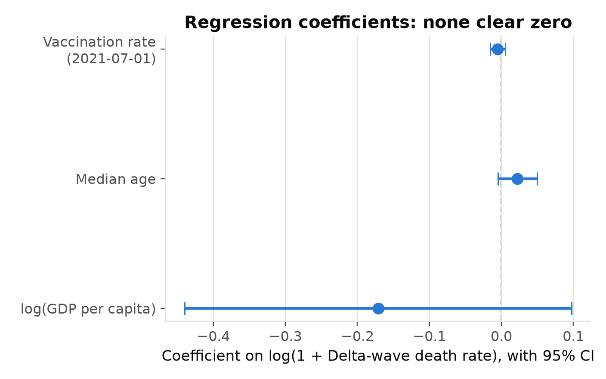

# COVID-19 Vaccine Rollout & Effectiveness

## Type

Original analysis.

## Objective

Two questions about the global COVID-19 vaccine rollout:

1. Did vaccine rollout speed differ systematically by country income level?
2. Did higher vaccination coverage going into the Delta wave predict lower
   mortality during it, at the country level?

## Dataset

- **Source:** [Our World in Data COVID-19 dataset](https://github.com/owid/covid-19-data)
  (`owid-covid-data.csv`), fetched via its GitHub mirror
  (`raw.githubusercontent.com/owid/covid-19-data/master/public/data/owid-covid-data.csv`)
  — the direct `covid.ourworldindata.org` host was not reachable from this
  environment, so the GitHub mirror was used instead; both serve the same
  underlying file.
- **License:** CC BY 4.0 (Our World in Data).
- **Accessed:** 2026-08-02. The upstream file is live and updated daily
  (~95MB, 429k rows, every country/day since 2020-01-01), so for
  reproducibility this project freezes a trimmed snapshot rather than
  re-fetching it on every run — see `src/fetch_data.py`.
- **Frozen subset** (`data/raw/owid_covid_subset.csv`, ~4.7MB, 68,302 rows):
  countries with population > 1,000,000 plus the four official World Bank
  income-group aggregate rows OWID publishes directly (`Low-income
  countries`, `Lower-middle-income countries`, `Upper-middle-income
  countries`, `High-income countries`), restricted to 2020-12-01–2021-12-31
  and 11 relevant columns (vaccination rates, death/case rates, median age,
  GDP per capita, population).

## Methodology

1. **Fetch & subset** (`src/fetch_data.py`): downloads the full OWID CSV and
   writes the frozen, documented subset described above.
2. **Prepare** (`src/prepare_data.py`): builds two analysis tables —
   `income_group_series.csv` (daily vaccination rate by income group, for
   the rollout-speed comparison) and `country_snapshot.csv` (one row per
   country: vaccination coverage on 2021-07-01, mean daily deaths per
   million over the Delta-wave window 2021-08-01–2021-10-31, and the
   median-age / GDP-per-capita covariates).
3. **Analyze** (`src/analyze.py`): Pearson/Spearman correlation plus an OLS
   regression, `log1p(delta_wave_death_rate) ~ vax_rate_2021_07_01 +
   median_age + log(gdp_per_capita)`. Outcome and GDP are log-transformed
   because both are right-skewed (skew 1.56 and 1.89 respectively — standard
   for this kind of data). Median age and GDP per capita are included as
   covariates because both plausibly affect a country's COVID mortality
   independently of vaccination coverage, and both also correlate with how
   early a country accessed vaccines — omitting them risks attributing their
   effect to vaccination coverage.
4. **Visualize** (`src/visualize.py`): the four figures below.

### Why this design, and its limits

This is a **country-level (ecological) cross-sectional design**, not an
individual-level study: it asks whether countries with higher aggregate
vaccination coverage had lower aggregate mortality, not whether vaccinated
individuals were less likely to die than unvaccinated ones. That distinction
matters for how to read the results below.

## Installation

```bash
pip install -r requirements.txt
```

## Reproducing the results

```bash
python src/fetch_data.py     # -> data/raw/owid_covid_subset.csv
python src/prepare_data.py   # -> data/processed/{income_group_series,country_snapshot}.csv
python src/analyze.py        # -> results/regression_results.json
python src/visualize.py      # -> results/figures/*.png
```

## Results

### 1. Vaccine rollout speed by income group



By 2021-12-31, high-income and upper-middle-income countries had fully
vaccinated roughly two-thirds to three-quarters of their populations;
lower-middle-income countries about a third; **low-income countries just
3.8%** — up from 0.15% six months earlier. This is a large, persistent
equity gap, not a temporary lag that closed over the year.

### 2. Wealth predicted early vaccination coverage



At the country level, `log(GDP per capita)` correlates strongly with
vaccination coverage as of 2021-07-01: **Pearson r = 0.61, p < 0.001**
(n = 65 countries). This is a robust, statistically decisive finding.

### 3. Vaccination coverage vs. Delta-wave mortality — no clear relationship




| Test | Statistic | p-value |
|---|---|---|
| Pearson r (vax rate vs. log death rate) | −0.183 | 0.144 |
| Spearman ρ (vax rate vs. death rate) | −0.110 | 0.382 |
| OLS regression, vax rate coefficient | −0.0053 | 0.318 |
| Overall model R² (adj.) | 0.076 (0.031) | F-test p = 0.180 |

None of these reach conventional significance (p < 0.05), and the
regression explains almost none of the cross-country variance in Delta-wave
mortality (adjusted R² = 0.03). **At this country-level, aggregate scale, we
cannot detect a mortality benefit from vaccination coverage** — full results
in `results/regression_results.json`.

## Interpretation: why the null result, and what it does and doesn't mean

This null result does **not** contradict the extensive individual-level
evidence (randomized trials, cohort studies) that COVID-19 vaccines reduced
individual mortality risk substantially. It illustrates a different,
well-known limitation:

- **Ecological/aggregation bias.** Country-level averages wash out the
  within-country contrast between vaccinated and unvaccinated individuals —
  which is where the real effectiveness signal lives — and instead measure a
  much noisier country-to-country comparison confounded by dozens of other
  factors.
- **Uncontrolled confounders.** Testing rates and death-reporting quality
  vary enormously by country (poorer countries plausibly undercount COVID
  deaths, which would bias the estimated relationship); non-pharmaceutical
  interventions (lockdowns, mask mandates), healthcare system capacity, and
  prior-infection-acquired immunity all differ by country and were not
  controlled for here.
- **Timing misalignment.** The fixed Aug–Oct 2021 window captures the Delta
  wave at a different epidemic phase in different countries, adding noise
  to the outcome measure.
- **Small sample.** n = 65 countries gives limited statistical power to
  detect a moderate effect size even if a true relationship exists.

The honest takeaway: **this simple country-level design is a weak
instrument for detecting vaccine effectiveness**, and its null result should
not be read as evidence against vaccination — only as a limitation of
aggregate, ecological analysis relative to individual-level clinical
evidence.

## Limitations

- Ecological (country-level) design — see interpretation above; results
  should not be read as individual-level causal effects.
- No control for testing/reporting quality, non-pharmaceutical
  interventions, prior infection rates, or vaccine type/dose distribution.
- Single fixed reference date and outcome window; results were not
  re-tested across alternative windows, so some sensitivity to this specific
  choice is possible (this was a deliberate choice to avoid multiple-testing
  / specification search rather than an oversight).
- Income groups reproduce OWID's own World Bank aggregate classification, so
  that part of the analysis inherits any limitations of that classification.
- 65-country regression sample after requiring complete data on all
  variables; some countries (notably very small states and a few
  low-reporting-capacity countries) are excluded.

## Conclusions

Two clearly different findings from the same dataset: **vaccine rollout
speed tracked country wealth closely and robustly** (r = 0.61, p < 0.001),
producing a large and persistent global equity gap that had barely narrowed
for low-income countries by the end of 2021. By contrast, **a simple
country-level correlation between vaccination coverage and subsequent
mortality found no statistically significant relationship** — a genuine null
result attributable to the limits of ecological analysis, not evidence
against vaccine effectiveness. Together they illustrate both a real, robust
equity finding and an instructive limitation of aggregate cross-country data
for questions that are best answered at the individual level.
